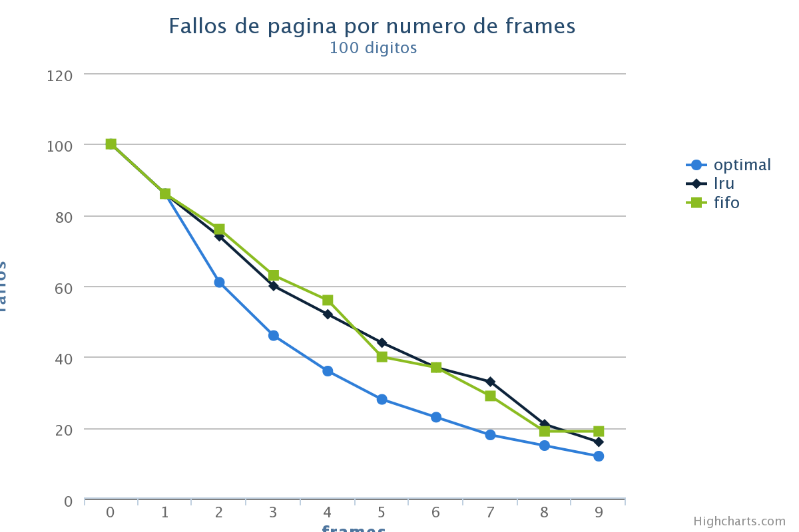
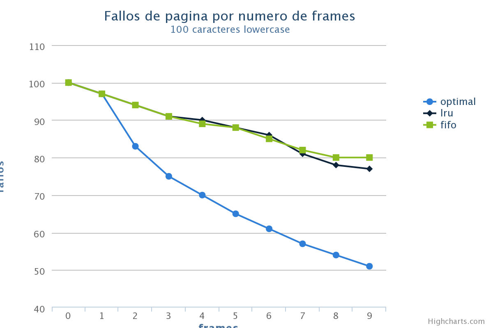
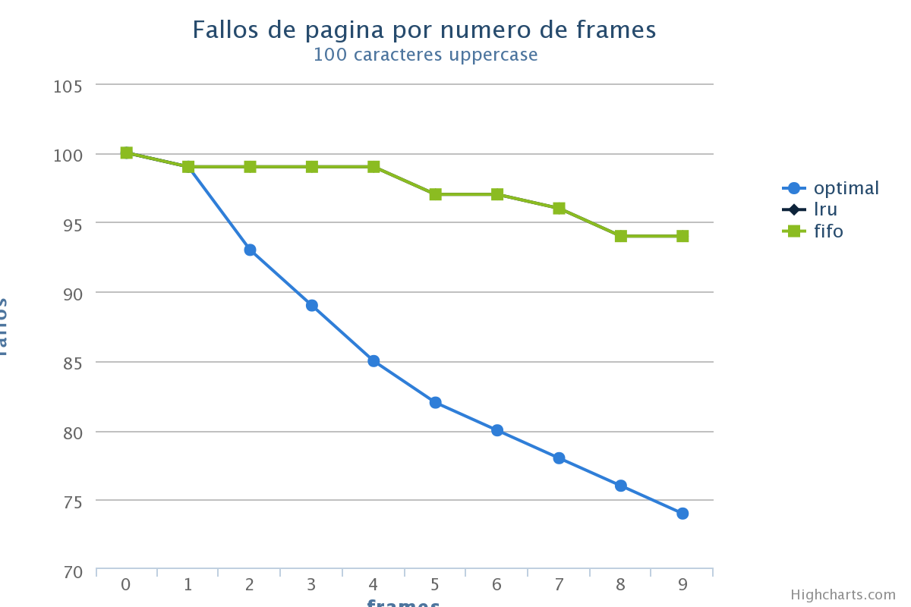

#Laboratorio 4

el codigo se adjunto en el trabajo, también se puede encontrar en:

https://github.com/xyos/paging/

##1. Paginación y corrimiento

El programa se adjunto en el zip como parser.js, necesita node.js version 0.8.16 o superior, modo de uso:

    node parser.js `page_size` `address`
    
    
##2. Algoritmos de paginación

para el desarrollo de este punto del laboratorio se recrearon los 3 algoritmos de paginación de la siguiente forma:

####FIFO -> FIFO.js

se creo un queue usando un Array de JavaScript y las funciones Array.shift() y Array.push() y un algoritmo de busqueda para el queue.

####LRU -> LRU.js

ademas del algoritmo de busqueda y el queue se implemento un contador de uso y una funcion de busqueda del mayor contador dentro del queue, se  modifico el shift() por un splice() para sacar los objetos con mayor contador

####OPT -> OPT.js

se proceso el array de datos inicial y se le agregó el tiempo hasta la próxima ocurrencia de cada caractér, se tuvo en cuenta este valor para aplicar el splice al queue implementado con un Array de JavaScript

====

### Metodología

se creo una función paging test para alimentar la grafica genera por *HighCharts* como variables se tomaron en cuenta el numero de caracteres y la cantidad de caracteres base para cada cadena:

    var numbers = "0123456789";
    var lowercase = "abcdefghijklmnopqrstuvwxyz0123456789"
    var uppercase = "ABCDEFGHIJKLMNOPQRSTUVWXYZabcdefghijklmnopqrstuvwxyz0123456789"
    
se generaron 3 graficas con las diferentes bases aplicando cadenas de 10 caracteres 

====

####Solo Dígitos [0-9]

====

####Minusculas [a..z,0-9]

====

####Minusculas [A..Z,a..Z,0-9]

====

###Conclusiones

1. Vemos que a mayor cantidad de caracteres presentes en la cadena, FIFO y LRU se vuelven mas ineficientes.
2. Con un numero grande de caracteres FIFO y LRU se comportan de manera muy parecida
3. Entre menos caracteres hayan mejor se comportan FIFO y LRU
4. los valores de FIFO no siempre decrecen de manera constante a diferencia de LRU
5. entre mas caracteres hayan LRU y FIFO se separaran mas del valor optimo.